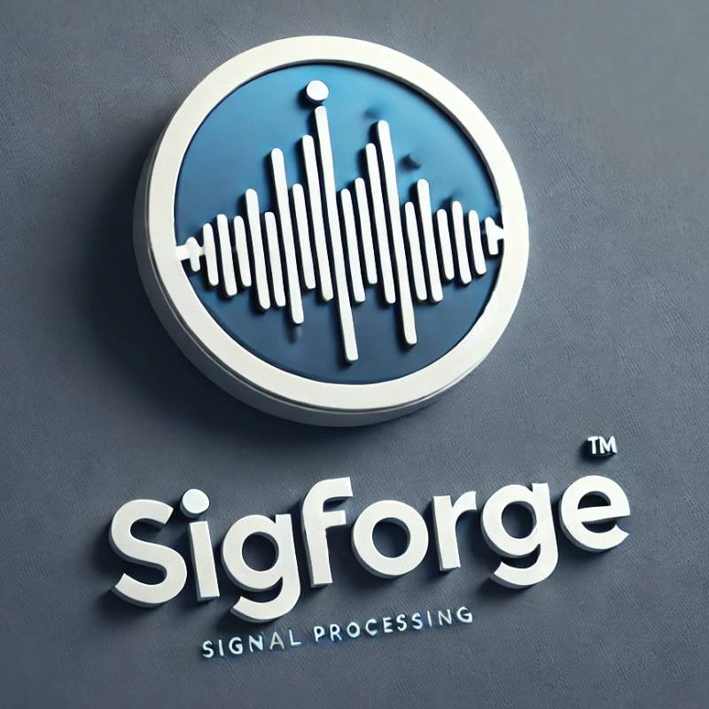

# SigForge
SigForge is a scriptable,  plugin based signal acquisition, visualization and processing tool for Windows OS.

[Latest binary release](https://github.com/tamask1s/SigForge/releases/download/V0.3/SigForge_V03.7z)

[Please check the documentation](https://tamask1s.github.io/SigForge/)

